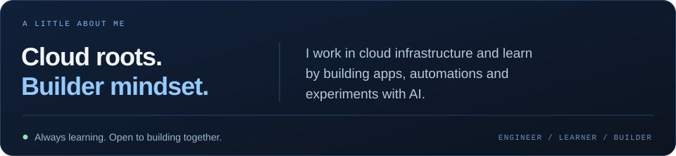
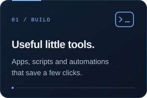
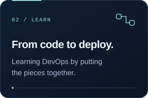
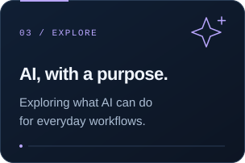
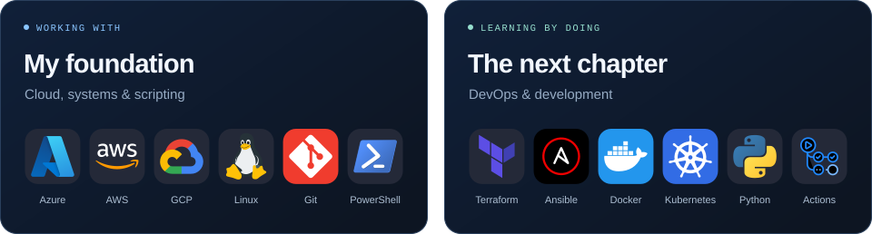
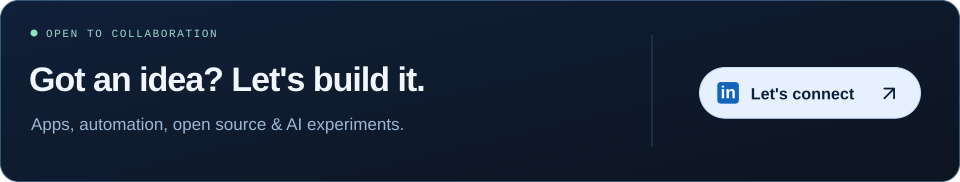

<picture>
  <source media="(max-width: 600px)" srcset="assets/hero-mobile.svg">
  
</picture>

  <a href="https://linkedin.com/in/shivam-singh-cloudinfra">LinkedIn ↗</a>&nbsp;&nbsp; / &nbsp;&nbsp;<a href="https://github.com/chromazo?tab=repositories">Explore my repos ↗</a>

<picture>
  <source media="(max-width: 600px)" srcset="about-mobile.svg">
  
</picture>

### On my workbench

  
  
  

### Tools along the way

<picture>
  <source media="(max-width: 600px)" srcset="toolkit-mobile.svg">
  
</picture>

 

<a href="https://linkedin.com/in/shivam-singh-cloudinfra">
<picture>
  <source media="(max-width: 600px)" srcset="contact-mobile.svg">
  
</picture>
</a>

 

Shivam Singh / <a href="https://github.com/chromazo">@chromazo</a> · Still figuring things out. Still building.
